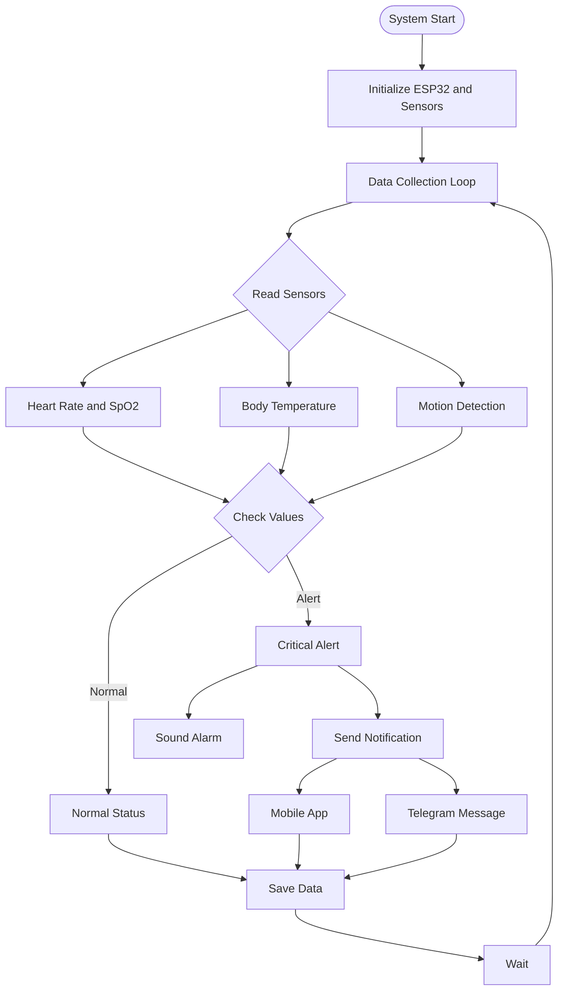

  

# AlertAngel

AlertAngel is an elderly-care monitoring system that provides real-time health tracking, fall detection, and instant alerts for caregivers.

## Form factor 

**AlertAngel** devices are inspired by the GitHub Universe ID Cards i.e AlertAngel devices are also ID cards with a screen.

## What It Does
- Continuous monitoring of **heart rate**, **SpO₂**, **temperature**, and **motion**
- **Fall detection** with immediate alerts
- Simple **on-device display** for vitals and warnings
- **Medicine reminders** and **cognitive test buttons**
- Notifications through **Telegram** and a **mobile app**
- **Health data logging** for future review
- System alerts like **low battery** and **phone disconnected**

## How It Works
The ESP32 collects sensor data, checks for irregularities, updates the display, and sends instant notifications to caregivers.

## Why It Matters
AlertAngel offers an affordable, easy-to-use solution for families and caregivers needing reliable, continuous elderly monitoring.

👉 For full technical details, visit:  
**[https://github.com/AlertAngel/tech_stack](https://github.com/AlertAngel/tech_stack)**

## Workflow 

